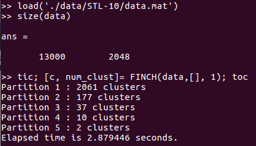

# First Integer Neighbor Clustering Hierarchy (FINCH) Algorithm

The repository contains our Python and Matlab code for the proposed FINCH clustering algorithm described in our **Efficient Parameter-free Clustering Using First Neighbor Relations** CVPR 2019 oral [paper](http://openaccess.thecvf.com/content_CVPR_2019/papers/Sarfraz_Efficient_Parameter-Free_Clustering_Using_First_Neighbor_Relations_CVPR_2019_paper.pdf).

```
@inproceedings{finch,
    author    = {M. Saquib Sarfraz, Vivek Sharma and Rainer Stiefelhagen}, 
    title     = {Efficient Parameter-free Clustering Using First Neighbor Relations}, 
    booktitle = {Proceedings of the IEEE Conference on Computer Vision and Pattern Recognition (CVPR)},
    pages = {8934--8943}
    year  = {2019}
}
```


##### Requirements

Python : numpy, scipy, sklearn

Matlab : 2017 or above: may run on earlier versions as well

**Optional**.  Install [pyflann](https://github.com/nashory/pyflann) or [flann](https://github.com/mariusmuja/flann) to get first neighbours from Kd-tree for large data


## Usage:

**Python :** 
typically you would run: 
``` 
from finch import FINCH
c, num_clust, req_c = FINCH(data)

```
You can set options e.g., required number of cluster or distance etc,

```
c, num_clust, req_c = FINCH(data, initial_rank=None, req_clust=None, distance='cosine', verbose=True)
```

See also readme in python repo.

**Matlab :** Please go in the path where you copied this folder or add its path to your Matlab path.

``` 
[c, num_clust]= FINCH(data, initial_rank, verbose);
```

Input:

* data: data Matrix (feature vecotrs in rows)
* initial_rank [Optional]: Nx1  (1-neighbour) indices vector. Pass empty [] to compute the 1st neighbor via pdist or flann
* verbos : printing some output

Output:

* c: N x P matrix  Each column vector contains cluster labels for each partition P
* num_clust: shows total number of cluster in each partition P

In Matlab typically you would run: 
```
[c, num_clust]= FINCH(data,[], 1);
```


**Example:** Cluster the STL-10 data (13000 images of 10 object classes. We provide the used 2048 CNN resnet features.
Please load the  data in Matlab from /data/STL_10/data.mat. This has 13000 vectors stored as a matrix of size (13000,2048), each vector is 2048 dimensional.


Now cluster it using FINCH, run the above command with tic toc to see the runtime. The run time includes computing first neighbours via exact distance and every thing.



On our machine it was < 3 seconds, it should be about the same depending upon if your machine has similar specs.

it returns the cluster labels for each partition in the variable c which will be of size (N x numPartitions) e.g., (13000, 5) in this case. Each column in array c provides cluster labels for that partition.

num_clust provides how many cluster it has produced in each partition or step of the run.


As you see: num_clust = [2061, 177, 37, 10, 2]

inidicating it found 2061 clusters in step 1, 177 in step 2 and so on to 10 clusters in step 4. You can pick the respective cluster labels for the data in the returned array c. For example, c(:,4) will provide labels for 10 clustering result.

**[Evaluation]**: 
The true labels for this data are also provided in the same repo in label.mat file. You can run any performance metric e.g., to compute NMI metric use nmi.mat function (provided in utils) and run nmi(labels, c(:,4)), or compute BCubed Fscore with b3(labels, c(:,4)).

Similarly you can run FINCH on other datasets e.g., we provide the used mnist10k and mice protein data.

### Required number of Clusters

We provide a very simple approximation to refine one of the FINCH partition to come down to required number of clusters. However, please note this is not recommended and provided here just for completeness.
One could use better ways to refine a partition, if needed.

**Python:**  Set it in the `req_clust` input option.

**Matlab:** ```req_c = req_numclust(c, data,req_clust)```

**Example**:
```
req_c= req_numclust(c(:,3), data, 15)
```
 Provides the required 15 clusters by refining the respective FINCH partition (37 clusters), from FINCH returned c mat in the above example. See function help for more details.


### Note:
To run it on large data >70k samples, install [flann library](https://github.com/mariusmuja/flann) (In matlab, see [flann_nn.m](https://github.com/ssarfraz/FINCH-Clustering/blob/master/FINCH_Core/flann_nn.m)), it will automatically switch to use flann (kd tree) for finding 1st neighbours.
 Note that you can also change when to switch to using flann in python [finch.py] or in the matlab function [clustRank.m] line 10.

**Finally**, if you use FINCH on 2D toy data (for visualization) then use euclidean distance. In python [finch.py] as input option or in matlab, the file [clustRank.m] line 11. as here you have xy coordinates of each point to cluster.

**The code and FINCH algorithm is not meant for commercial use. Please contact the author below for licensing information.**

M. Saquib Sarfraz (saquib.sarfraz@kit.edu)
