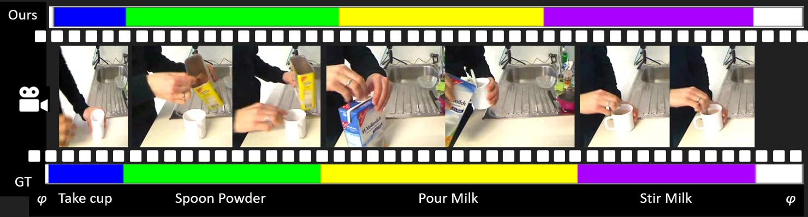

# TW-FINCH Algorithm for Videos



The repository contains our code for the proposed method described in our CVPR 2021 paper **Temporally-Weighted Hierarchical Clustering for Unsupervised Action Segmentation** . [Read Paper](https://research.fb.com/publications/temporally-weighted-hierarchical-clustering-for-unsupervised-action-segmentation/)

```
@inproceedings{tw-finch,
    author    = {M. Saquib Sarfraz, Naila Murray, Vivek Sharma, Ali Diba, Luc Van Gool, Rainer Stiefelhagen}, 
    title     = {Temporally-Weighted Hierarchical Clustering for Unsupervised Action Segmentation}, 
    booktitle = {Proceedings of the IEEE Conference on Computer Vision and Pattern Recognition (CVPR)},    
    year  = {2021}
}
```


### Abstract:
Action segmentation refers to inferring boundaries of semantically consistent visual concepts in videos and is an important requirement for many video understanding tasks. 
For this and other video understanding tasks, supervised approaches have achieved encouraging performance but require a high volume of detailed frame-level annotations. We present a fully automatic and unsupervised approach for segmenting actions in a video that does not require any training. Our proposal is an effective temporally-weighted hierarchical clustering algorithm that can group semantically consistent frames of the video. Our main finding is that representing a video with a 1-nearest neighbor graph by taking into account the time progression is sufficient to form semantically and temporally consistent clusters of frames where each cluster may represent some action in the video. Additionally, we establish strong unsupervised baselines for action segmentation and show significant performance improvements over published unsupervised methods on five challenging action segmentation datasets.


####  DataSets : We provide all 5 used datasets (features and labels)

All datasets  i.e. 'Breakfast', 'Hollywood_extended', '50Salads', 'MPII_Cooking', 'YTI' are provided as one tar ball (~4 GB). 
Please credit the original authors who shared the feature vectors of these datasets (please see our paper).

Downlaod link: https://bwsyncandshare.kit.edu/s/GtWYdcHckJNtRzJ

### Run Action segmentation on video datsets
 
Both Python and Matlab implementations of TW_FINCH are included and supports data reading and evaluation on the datasets.        

* Python

```
from run_on_dataset import run_twfinch

Result = run_twfinch(dataset_name = None, datasets_path = None, tw_finch=True, verbose=True);
```

* Matlab

Add the matlab folder to your Matlab path

Run  MATLAB file [run_on_dataset.m](https://github.com/ssarfraz/FINCH-Clustering/blob/master/TW-FINCH/run_on_dataset.m) to reproduce the results in the paper. 
```
tw_finch = true
Result = run_on_dataset(Dataset_name, tw_finch, datasets_root_path);
```

Input:

* dataset_name: dataset name - one of 'Breakfast', 'Hollywood_extended', '50Salads', 'MPII_Cooking', 'YTI'
* tw_finch: true or false: pass true to run tw_finch else will run finch
* datasets_path : root folder path where all dataset folders exist. See above the link to download all datasets

Output
* Result: computed metrics on full dataset and detailed results per video